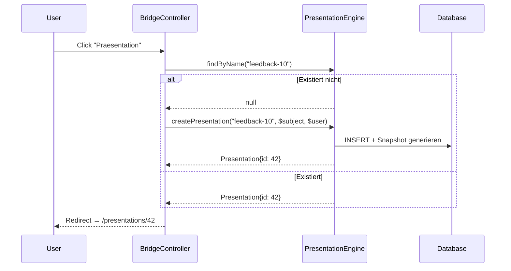

# Laravel Presentation Module

Eigenstaendiges Composer-Package fuer browser-basierte Slide-Praesentationen in Laravel-Anwendungen. Bietet einen Present-Modus (read-only mit Vollbild) und einen Edit-Modus (Sidebar-Editor mit Slide-Management).

## Features

- **Present-Modus**: Read-Only Vollbild-Praesentation mit Tastatur-Navigation
- **Edit-Modus**: PowerPoint-aehnlicher Editor mit Sidebar und Drag-and-Drop
- **PDF-Export**: Client-seitig via html2canvas + jsPDF
- **Snapshot-Persistenz**: Slide-Daten als JSON in der DB gespeichert
- **Polymorphe Zuordnung**: Praesentationen koennen beliebigen Models zugeordnet werden
- **Name-basierter Lookup**: Eindeutiger `name` fuer programmatischen Zugriff
- **Erweiterbar**: Host-App definiert Slides und Datenquellen ueber Contracts

## Installation

```bash
composer require trafficdesign/laravel-presentation
```

### Artisan Install-Command

```bash
php artisan presentation:install
```

Scaffoldet die noetige Adapter-Klassen und Views.

### Migration ausfuehren

```bash
php artisan migrate
```

### Config publizieren (optional)

```bash
php artisan vendor:publish --tag=presentation-config
```

## Architektur

```
Host-App (z.B. 360-Feedback)
    │
    ├── PresentationBridgeController    ← Lookup by name, Create, Redirect
    ├── FeedbackSlideBuilder            ← Implementiert SlideBuilderInterface
    ├── FeedbackDataCollector           ← Implementiert DataCollectorInterface
    ├── FeedbackAuthorizer              ← Implementiert AuthorizerInterface
    │
    └── Views
        ├── presentation/show.blade.php ← Extends presentation::layout
        └── presentation/edit.blade.php ← Extends presentation::edit-layout
```

```
Package (trafficdesign/laravel-presentation)
    │
    ├── PresentationEngine              ← Zentraler Service
    ├── PresentationController          ← Routes-Handler
    ├── Presentation Model              ← DB-Entity mit Snapshot
    │
    ├── Contracts/
    │   ├── SlideBuilderInterface       ← Slide-Definition
    │   ├── DataCollectorInterface      ← Daten-Sammlung
    │   └── AuthorizerInterface         ← Zugriffsrechte
    │
    └── Views
        ├── layout.blade.php            ← Present-Modus Base-Layout
        ├── edit-layout.blade.php       ← Edit-Modus Base-Layout
        └── partials/                   ← Topbar, Controls, Sidebar
```

## Datenfluss



## Routes

| Method | Route | Name | Beschreibung |
|---|---|---|---|
| GET | `/presentations/by-name/{name}` | `presentation.lookup` | Lookup per Name (JSON) |
| POST | `/presentations` | `presentation.create` | Neue Praesentation (JSON) |
| GET | `/presentations/{id}` | `presentation.show` | Present-Modus |
| GET | `/presentations/{id}/edit` | `presentation.edit` | Edit-Modus |
| POST | `/presentations/{id}/save` | `presentation.save` | Slide-State speichern |
| POST | `/presentations/{id}/regenerate` | `presentation.regenerate` | Neu generieren |
| POST | `/presentations/{id}/rename` | `presentation.rename` | Umbenennen |
| POST | `/presentations/{id}/slides` | `presentation.slides.add` | Slide hinzufuegen |
| DELETE | `/presentations/{id}/slides/{slideId}` | `presentation.slides.remove` | Slide entfernen |

## Contracts

### SlideBuilderInterface

```php
public function buildSlides(Model $subject, array $data): array;
```

### DataCollectorInterface

```php
public function collectData(Model $subject): array;
public function resolveTitle(Model $subject): string;
```

### AuthorizerInterface

```php
public function authorize(Request $request, Model $subject): void;
public function backUrl(Model $subject): string;
```

## Konfiguration

```php
return [
    'subject_model' => App\Models\Feedback::class,
    'user_model' => App\Models\User::class,
    'route_prefix' => 'presentations',
    'middleware' => ['web', 'auth', 'verified'],
    'view' => 'presentation.show',
    'edit_view' => 'presentation.edit',
    'enable_edit_mode' => true,
    'slide_width' => 1280,
    'slide_height' => 720,
    'accent_color' => '#00AFCE',
    // ...
];
```

## Slide-Snapshot

Praesentationen speichern ihren kompletten Slide-State als JSON:

```json
{
  "id": "title",
  "type": "title",
  "theme": "dark",
  "title": "Mein Titel",
  "source": "generated",
  "data": { ... }
}
```

- `source: "generated"` — wird bei Regenerierung ueberschrieben
- `source: "user"` — manuell erstellte Slides, bleiben bei Regenerierung erhalten

## Lizenz

MIT
